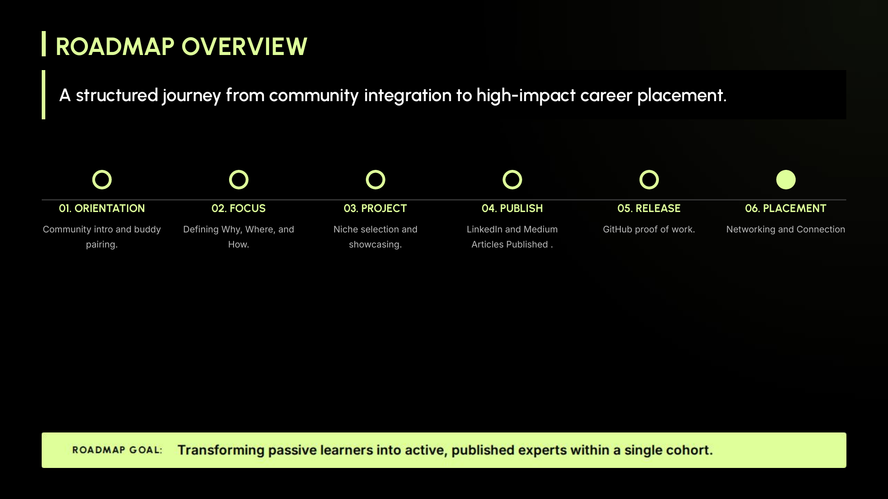
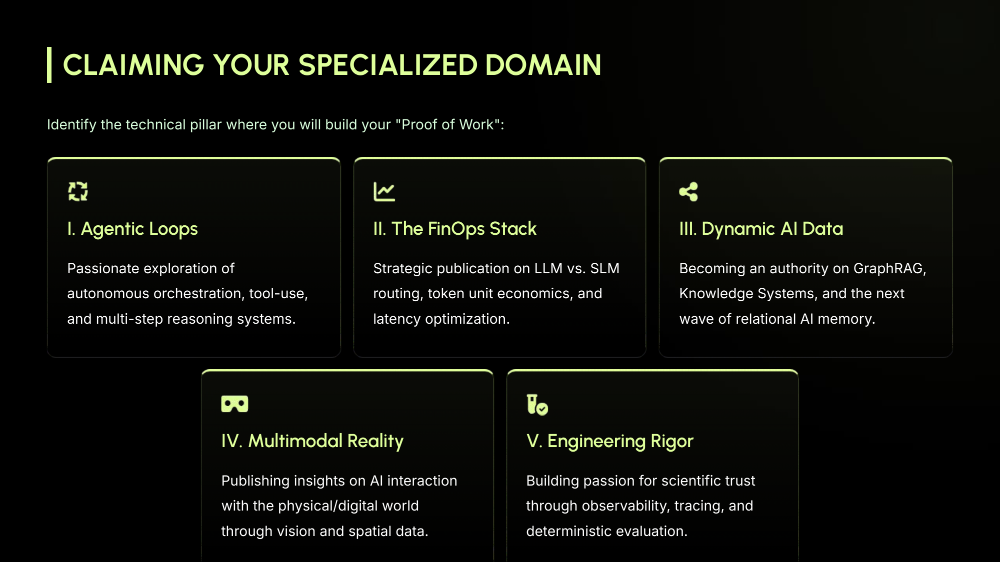
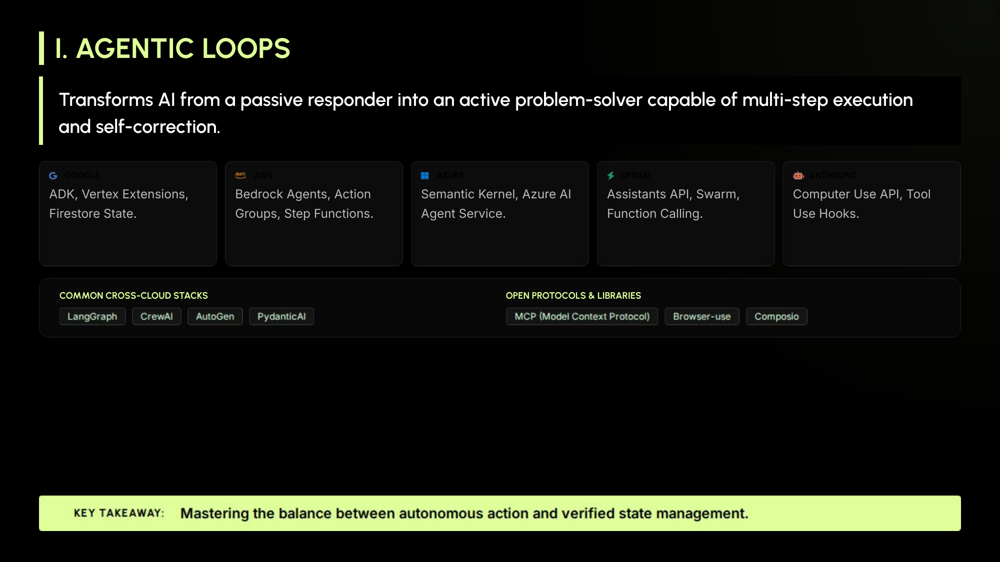
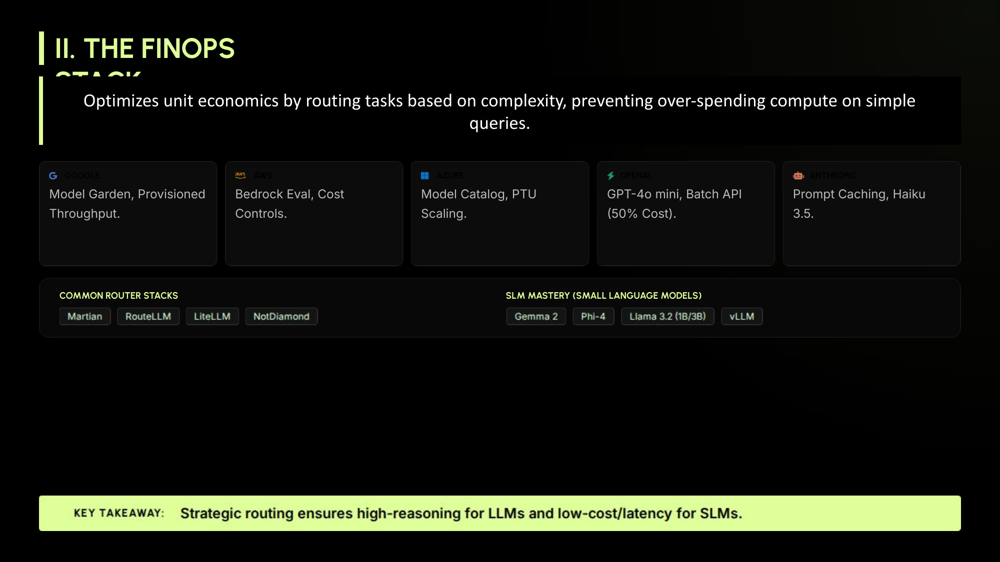
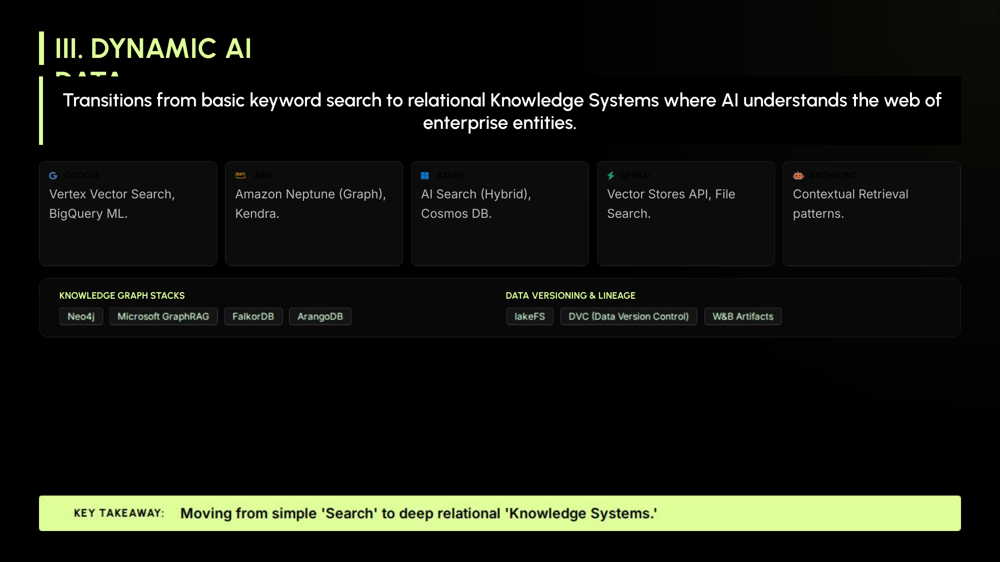
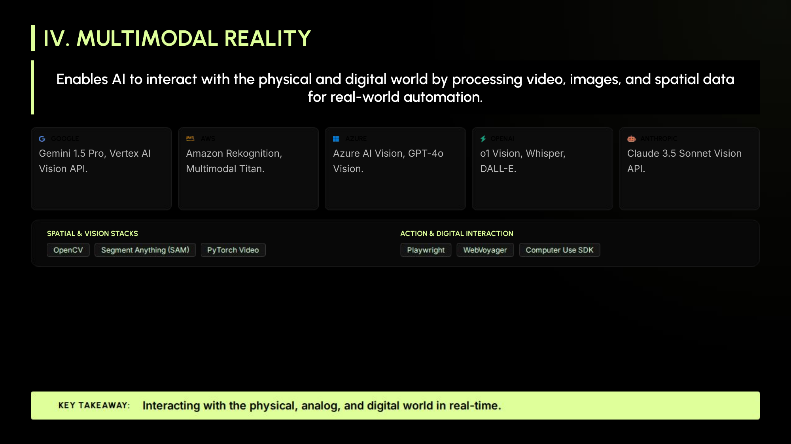
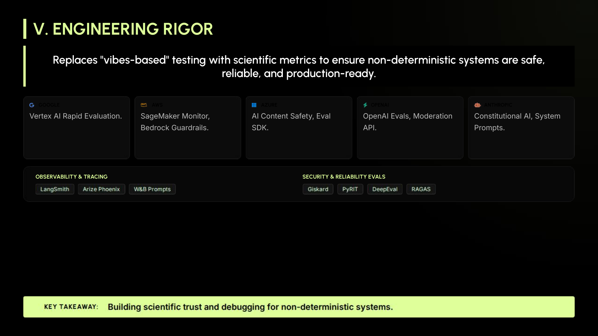
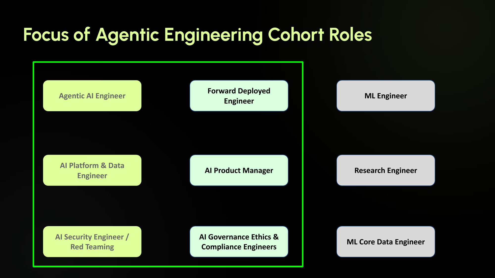
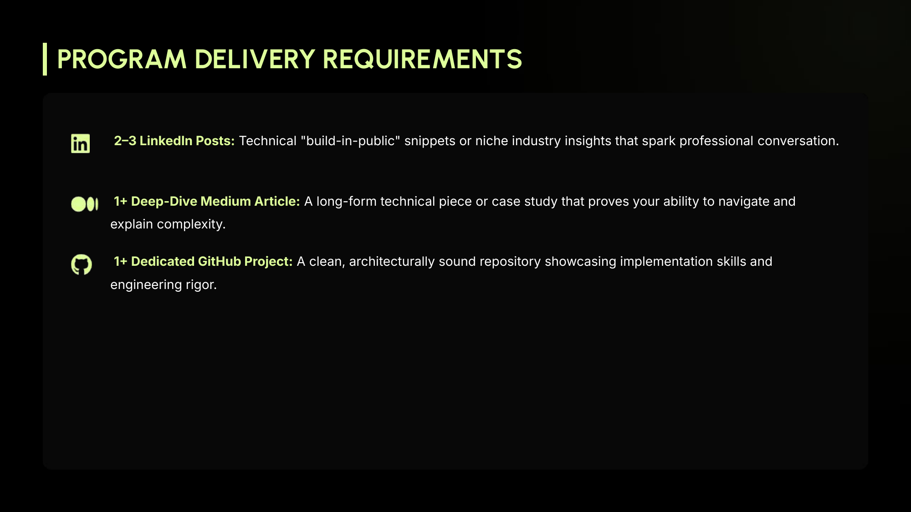

# Lesson 1: The Agentic Shift and the Shape of the Cohort

## Video Overview

[](https://youtu.be/7tlHGuO9Vnw)

▶ [Watch on YouTube: Lesson 1 Video Overview](https://youtu.be/7tlHGuO9Vnw)

*Each section opens with the slide's takeaway. The **▼ Detailed breakdown** boxes expand to the slide content, **📚 Further reading** links, and a **🎓 Socratic study prompt** you can paste into Claude or ChatGPT.*

## Contents

- [The Central Thesis](#the-central-thesis)
- [The Six-Milestone Roadmap](#the-six-milestone-roadmap)
- [The Five Foundational Concepts](#the-five-foundational-concepts)
  - [I. Agentic Loops](#i-agentic-loops)
  - [II. The FinOps Stack](#ii-the-finops-stack)
  - [III. Dynamic AI Data](#iii-dynamic-ai-data)
  - [IV. Multimodal Reality](#iv-multimodal-reality)
  - [V. Engineering Rigor](#v-engineering-rigor)
- [The Six AI Engineering Roles](#the-six-ai-engineering-roles)
  - [Agentic AI Engineer](#agentic-ai-engineer)
  - [Forward Deployed Engineer](#forward-deployed-engineer)
  - [AI Platform & Data Engineer](#ai-platform--data-engineer)
  - [AI Product Manager](#ai-product-manager)
  - [AI Security Engineer / Red Teaming](#ai-security-engineer--red-teaming)
  - [AI Governance, Ethics & Compliance Engineer](#ai-governance-ethics--compliance-engineer)
  - [What Is Deliberately Out of Scope](#what-is-deliberately-out-of-scope)
- [The Deliverable Triad: LinkedIn, Medium, GitHub](#the-deliverable-triad-linkedin-medium-github)
  - [Published Presence + Passionate Narrative](#published-presence--passionate-narrative)
- [Articles to Aim Toward (by niche × role)](#articles-to-aim-toward-by-niche--role)
- [Week 1 Assignments](#week-1-assignments)
  - [1. Define Your North Star](#1-define-your-north-star)
  - [2. Claim Your Territory](#2-claim-your-territory)
  - [3. Upgrade the Gourmet Party Planner App](#3-upgrade-the-gourmet-party-planner-app)
- [The Quality Deep Work Framework](#the-quality-deep-work-framework)
- [Where Lesson 1 Leaves You](#where-lesson-1-leaves-you)

## The Central Thesis

The cohort's central argument: AI engineering has crossed a threshold. The era of the linear chatbot has collapsed into the **Agentic Shift** — self-healing, multi-modal, autonomous agentic systems with measurable ROI.

Tagline: *Bridging the Academic-Enterprise Gap through High-Stakes AI Delivery.* Academic AI courses teach what a transformer is. Enterprise teams need engineers who can ship agents that survive in production. That gap is where this cohort plants its flag.

Sessions are live and interactive. No recordings. Buddy pairing covers missed material. The cohort is a working community, not a video library.

## The Six-Milestone Roadmap

*A structured journey from community integration to high-impact career placement — designed to transform passive learners into active, published experts within a single cohort.*



<details>
<summary><strong>▼ Detailed breakdown</strong></summary>

1. **Orientation** — community intro and buddy pairing.
2. **Focus** — defining your *Why*, *Where*, and *How*.
3. **Project** — niche selection and showcasing.
4. **Publish** — LinkedIn and Medium articles.
5. **Release** — GitHub proof of work.
6. **Placement** — networking and connection.

The promise is not "you will learn AI." The promise is that by the end you will be a published practitioner with a public artifact trail.

</details>

## The Five Foundational Concepts

Each student selects one of five foundational concepts as their subject-matter-expert (SME) niche. Pick one and you commit to going past surface level on it.



### I. Agentic Loops

*Transforms AI from a passive responder into an active problem-solver capable of multi-step execution and self-correction. The principle: master the balance between autonomous action and verified state management.*

<details>
<summary><strong>▼ Detailed breakdown</strong></summary>

The core pattern: **Plan → Act → Observe → Refine.** ReAct-style reasoning, orchestrator-worker patterns, tool-use, multi-step plans that recover from failure. The hard question isn't "can the model use a tool?" — it's "can the system survive ten tool calls in sequence with one failing silently?"



The slide names every major surface area:
- **Cross-cloud stacks:** Google ADK + Vertex Extensions + Firestore State; AWS Bedrock Agents + Action Groups + Step Functions; Azure Semantic Kernel + AI Agent Service; OpenAI Assistants API + Swarm + Function Calling; Anthropic Computer Use API + Tool Use Hooks.
- **Common cross-cloud frameworks:** LangGraph, CrewAI, AutoGen, PydanticAI.
- **Open protocols & libraries:** Model Context Protocol (MCP), Browser-use, Composio.

<details>
<summary><strong>📚 Further reading →</strong></summary>

- **Anthropic — *Building Effective Agents*** (2024) — opinionated taxonomy of orchestration patterns. The vocabulary the field is converging on. → [anthropic.com/research/building-effective-agents](https://www.anthropic.com/research/building-effective-agents)
- **ReAct paper** (Yao et al., 2022) — the Reason+Act prompting pattern almost every modern agent loop descends from. → [arxiv.org/abs/2210.03629](https://arxiv.org/abs/2210.03629)
- **LangGraph tutorial** — hands-on agentic loop with explicit state graphs. → [langchain-ai.github.io/langgraph/tutorials](https://langchain-ai.github.io/langgraph/tutorials/)
- **Model Context Protocol (MCP) spec** — Anthropic's open protocol for tool/context interop, named on the slide. → [modelcontextprotocol.io](https://modelcontextprotocol.io/)
- **Anthropic Tool Use docs** — practical reference for the tool-use hooks called out on the slide. → [docs.anthropic.com/.../tool-use](https://docs.anthropic.com/en/docs/build-with-claude/tool-use/overview)

</details>

<details>
<summary><strong>🎓 Socratic study prompt →</strong></summary>

Copy into Claude/ChatGPT, replacing the marked block with the Agentic Loops content above:

```
I'm studying Agentic Loops as part of an AI engineering cohort.
Below is the lesson material I'm working from. Engage me in a
Socratic conversation grounded ONLY in this material — do not
draw on outside knowledge unless I explicitly ask you to.

--- LESSON MATERIAL ---
[PASTE THE AGENTIC LOOPS SECTION HERE]
--- END ---

Goal: lead me to articulate, in my own words, the core principle —
"mastering the balance between autonomous action and verified state
management."

Rules:
- Ask me one question at a time
- Lead me toward naming the principle myself; don't tell me
- Never give me the answer unless I explicitly ask for it
- If I'm circling, ask a more pointed question that nudges me
  toward the principle
- Once I've named the principle in my own words, the conversation
  can flow wherever curiosity takes it — that's gravy

Start with your first question.
```

</details>

</details>

### II. The FinOps Stack

*Optimizes unit economics by routing tasks based on complexity, preventing over-spending compute on simple queries. The principle: strategic routing — high-reasoning to LLMs, low-cost / latency to SLMs.*

<details>
<summary><strong>▼ Detailed breakdown</strong></summary>

Token economics is what separates a demo from a sustainable product. FinOps covers LLM/SLM routing per call, prompt caching, batching, and latency optimization. A FinOps specialist can read an architecture and tell you cost-per-task and where spend is concentrated.



The slide names every major surface area:
- **Cross-cloud stacks:** Google Model Garden + Provisioned Throughput; AWS Bedrock Eval + Cost Controls; Azure Model Catalog + PTU Scaling; OpenAI GPT-4o mini + Batch API (50% cost); Anthropic Prompt Caching + Haiku 3.5.
- **Common router stacks:** Martian, RouteLLM, LiteLLM, NotDiamond.
- **SLM mastery:** Gemma 2, Phi-4, Llama 3.2 (1B/3B), vLLM.

<details>
<summary><strong>📚 Further reading →</strong></summary>

- **Anthropic prompt-caching docs** — operational; how to actually cut your token bill. Named on the slide. → [docs.anthropic.com/.../prompt-caching](https://docs.anthropic.com/en/docs/build-with-claude/prompt-caching)
- **FrugalGPT paper** (Stanford, 2023) — model cascading; the conceptual base for every router on the slide. → [arxiv.org/abs/2305.05176](https://arxiv.org/abs/2305.05176)
- **RouteLLM paper** (LMSYS, 2024) — open-source router benchmarked across cost-quality trade-offs. Named on the slide. → [arxiv.org/abs/2406.18665](https://arxiv.org/abs/2406.18665)
- **vLLM docs** — high-throughput serving runtime. Named on the slide. → [docs.vllm.ai](https://docs.vllm.ai/)
- **LiteLLM docs** — unified routing across 100+ providers. Named on the slide. → [docs.litellm.ai](https://docs.litellm.ai/)

</details>

<details>
<summary><strong>🎓 Socratic study prompt →</strong></summary>

```
I'm studying The FinOps Stack as part of an AI engineering cohort.
Below is the lesson material I'm working from. Engage me in a
Socratic conversation grounded ONLY in this material — do not
draw on outside knowledge unless I explicitly ask you to.

--- LESSON MATERIAL ---
[PASTE THE FINOPS STACK SECTION HERE]
--- END ---

Goal: lead me to articulate, in my own words, the core principle —
"strategic routing ensures high-reasoning for LLMs and low-cost /
latency for SLMs."

Rules:
- Ask me one question at a time
- Lead me toward naming the principle myself; don't tell me
- Never give me the answer unless I explicitly ask for it
- If I'm circling, ask a more pointed question that nudges me
  toward the principle
- Once I've named the principle in my own words, the conversation
  can flow wherever curiosity takes it — that's gravy

Start with your first question.
```

</details>

</details>

### III. Dynamic AI Data

*Transitions from basic keyword search to relational Knowledge Systems where AI understands the web of enterprise entities. The principle: move from simple "Search" to deep relational "Knowledge Systems."*

<details>
<summary><strong>▼ Detailed breakdown</strong></summary>

**GraphRAG** is the headline term: rather than chunking documents and retrieving by vector similarity alone, build a knowledge graph over the source material so retrieval can traverse relationships. Entities, relations, paths become first-class. Also covers relational AI memory — how agents remember across sessions and keep knowledge fresh. The pillar's question: when RAG is not enough, what comes next?



The slide names every major surface area:
- **Cross-cloud stacks:** Google Vertex Vector Search + BigQuery ML; AWS Amazon Neptune (Graph) + Kendra; Azure AI Search (Hybrid) + Cosmos DB; OpenAI Vector Stores API + File Search; Anthropic Contextual Retrieval patterns.
- **Knowledge graph stacks:** Neo4j, Microsoft GraphRAG, FalkorDB, ArangoDB.
- **Data versioning & lineage:** lakeFS, DVC, W&B Artifacts.

<details>
<summary><strong>📚 Further reading →</strong></summary>

- **Microsoft GraphRAG repo + paper** (2024) — the canonical GraphRAG reference implementation. Named on the slide. → [github.com/microsoft/graphrag](https://github.com/microsoft/graphrag)
- **Anthropic — *Contextual Retrieval*** (Sept 2024) — prepends per-chunk context summary before embedding. 35–67% reduction in retrieval failures. Named on the slide. → [anthropic.com/news/contextual-retrieval](https://www.anthropic.com/news/contextual-retrieval)
- **Neo4j — RAG patterns guide** — knowledge-graph-backed retrieval. Named on the slide. → [neo4j.com/developer-blog/knowledge-graph-rag-application](https://neo4j.com/developer-blog/knowledge-graph-rag-application/)
- **Lost in the Middle** (Liu et al., Stanford, 2023) — why naive long-context RAG fails. → [arxiv.org/abs/2307.03172](https://arxiv.org/abs/2307.03172)

</details>

<details>
<summary><strong>🎓 Socratic study prompt →</strong></summary>

```
I'm studying Dynamic AI Data as part of an AI engineering cohort.
Below is the lesson material I'm working from. Engage me in a
Socratic conversation grounded ONLY in this material.

--- LESSON MATERIAL ---
[PASTE THE DYNAMIC AI DATA SECTION HERE]
--- END ---

Goal: lead me to articulate, in my own words, the core principle —
"moving from simple 'Search' to deep relational 'Knowledge Systems.'"

Rules:
- Ask me one question at a time
- Lead me toward naming the principle myself; don't tell me
- Never give me the answer unless I explicitly ask for it
- If I'm circling, ask a more pointed question that nudges me
  toward the principle
- Once I've named the principle in my own words, the conversation
  can flow wherever curiosity takes it — that's gravy

Start with your first question.
```

</details>

</details>

### IV. Multimodal Reality

*Enables AI to interact with the physical and digital world by processing video, images, and spatial data for real-world automation. The principle: interact with the physical, analog, and digital world in real time.*

<details>
<summary><strong>▼ Detailed breakdown</strong></summary>

Pixels, video, spatial data — the bridge between physical and digital. Vision-language models, video understanding, spatial reasoning, and the engineering that lets an agent see and act. The frontier is sustained multimodal interaction: an agent watches a stream, maintains state about what it has seen, grounds its actions in the physical environment.



The slide names every major surface area:
- **Cross-cloud stacks:** Google Gemini 1.5 Pro + Vertex AI Vision API; AWS Amazon Rekognition + Multimodal Titan; Azure AI Vision + GPT-4o Vision; OpenAI o1 Vision + Whisper + DALL-E; Anthropic Claude 3.5 Sonnet Vision API.
- **Spatial & vision stacks:** OpenCV, Segment Anything (SAM), PyTorch Video.
- **Action & digital interaction:** Playwright, WebVoyager, Computer Use SDK.

<details>
<summary><strong>📚 Further reading →</strong></summary>

- **Anthropic — *Computer Use*** (Oct 2024) — frontier of "agent uses a screen." Computer Use SDK is named on the slide. → [anthropic.com/news/3-5-models-and-computer-use](https://www.anthropic.com/news/3-5-models-and-computer-use)
- **Segment Anything (SAM) paper** (Meta, 2023) — vision foundation model named on the slide. → [arxiv.org/abs/2304.02643](https://arxiv.org/abs/2304.02643)
- **WebVoyager paper** (2024) — agent that navigates real websites end-to-end. Named on the slide. → [arxiv.org/abs/2401.13919](https://arxiv.org/abs/2401.13919)
- **Gemini 1.5 technical report** — long-context multimodal benchmarks for the model named on the slide. → [arxiv.org/abs/2403.05530](https://arxiv.org/abs/2403.05530)

</details>

<details>
<summary><strong>🎓 Socratic study prompt →</strong></summary>

```
I'm studying Multimodal Reality as part of an AI engineering cohort.
Below is the lesson material I'm working from. Engage me in a
Socratic conversation grounded ONLY in this material.

--- LESSON MATERIAL ---
[PASTE THE MULTIMODAL REALITY SECTION HERE]
--- END ---

Goal: lead me to articulate, in my own words, the core principle —
"interacting with the physical, analog, and digital world in real
time."

Rules:
- Ask me one question at a time
- Lead me toward naming the principle myself; don't tell me
- Never give me the answer unless I explicitly ask for it
- If I'm circling, ask a more pointed question that nudges me
  toward the principle
- Once I've named the principle in my own words, the conversation
  can flow wherever curiosity takes it — that's gravy

Start with your first question.
```

</details>

</details>

### V. Engineering Rigor

*Replaces "vibes-based" testing with scientific metrics to ensure non-deterministic systems are safe, reliable, and production-ready. The principle: build scientific trust and debugging for non-deterministic systems.*

<details>
<summary><strong>▼ Detailed breakdown</strong></summary>

Observability, tracing, deterministic evaluation. Eval harnesses that catch regressions before deploy. Test sets that survive model upgrades. Trace instrumentation to replay an agent run end-to-end. Dashboards that surface drift before users notice. Without this pillar, every agent is held together by hope.



The slide names every major surface area:
- **Cross-cloud stacks:** Google Vertex AI Rapid Evaluation; AWS SageMaker Monitor + Bedrock Guardrails; Azure AI Content Safety + Eval SDK; OpenAI Evals + Moderation API; Anthropic Constitutional AI + System Prompts.
- **Observability & tracing:** LangSmith, Arize Phoenix, W&B Prompts.
- **Security & reliability evals:** Giskard, PyRIT, DeepEval, RAGAS.

<details>
<summary><strong>📚 Further reading →</strong></summary>

- **Hamel Husain — *Your AI Product Needs Evals*** (2024) — industry-standard practical writeup on building eval harnesses. → [hamel.dev/blog/posts/evals/](https://hamel.dev/blog/posts/evals/)
- **OpenAI Evals repo** — runnable eval harness, named on the slide. → [github.com/openai/evals](https://github.com/openai/evals)
- **Constitutional AI paper** (Anthropic, 2022) — the technique behind Anthropic's safety stack, named on the slide. → [arxiv.org/abs/2212.08073](https://arxiv.org/abs/2212.08073)
- **RAGAS docs** — RAG evaluation framework, named on the slide. → [docs.ragas.io](https://docs.ragas.io/)
- **LangSmith docs** — observability + tracing for LLM apps, named on the slide. → [docs.smith.langchain.com](https://docs.smith.langchain.com/)

</details>

<details>
<summary><strong>🎓 Socratic study prompt →</strong></summary>

```
I'm studying Engineering Rigor as part of an AI engineering cohort.
Below is the lesson material I'm working from. Engage me in a
Socratic conversation grounded ONLY in this material.

--- LESSON MATERIAL ---
[PASTE THE ENGINEERING RIGOR SECTION HERE]
--- END ---

Goal: lead me to articulate, in my own words, the core principle —
"building scientific trust and debugging for non-deterministic
systems."

Rules:
- Ask me one question at a time
- Lead me toward naming the principle myself; don't tell me
- Never give me the answer unless I explicitly ask for it
- If I'm circling, ask a more pointed question that nudges me
  toward the principle
- Once I've named the principle in my own words, the conversation
  can flow wherever curiosity takes it — that's gravy

Start with your first question.
```

</details>

</details>

## The Six AI Engineering Roles

Alongside the foundational concept, each student picks a North Star role from six in-scope tracks.



### Agentic AI Engineer

*Focuses on autonomous systems that use tools and reason through multi-step tasks.*

<details>
<summary><strong>▼ Detailed breakdown</strong></summary>

Slide-named sub-competencies:
- **Orchestration Frameworks** — LangGraph, ADK, CrewAI, AutoGen.
- **Reasoning Patterns** — Chain-of-Thought (CoT), ReAct.
- **Tool-Use Design** — robust APIs LLMs can interface with for action execution.
- **Evaluation** — LLM-as-a-judge frameworks for agentic reliability.

<details>
<summary><strong>📚 Further reading →</strong></summary>

- **Anthropic — *Building Effective Agents*** — canonical orchestration-pattern essay. → [anthropic.com/research/building-effective-agents](https://www.anthropic.com/research/building-effective-agents)
- **ReAct paper** (Yao et al., 2022) — named in the slide's reasoning-patterns sub-competency. → [arxiv.org/abs/2210.03629](https://arxiv.org/abs/2210.03629)
- **Chain-of-Thought paper** (Wei et al., 2022) — named in the slide's reasoning-patterns sub-competency. → [arxiv.org/abs/2201.11903](https://arxiv.org/abs/2201.11903)
- **LangGraph tutorial** — named in the slide's orchestration-frameworks sub-competency. → [langchain-ai.github.io/langgraph/tutorials](https://langchain-ai.github.io/langgraph/tutorials/)

</details>

<details>
<summary><strong>🎓 Socratic study prompt →</strong></summary>

```
I'm exploring whether the Agentic AI Engineer role fits me. Below
is the role definition. Engage me in a Socratic conversation
grounded ONLY in this material.

--- LESSON MATERIAL ---
[PASTE THE AGENTIC AI ENGINEER SECTION HERE]
--- END ---

Goal: lead me to articulate the role's core focus — "autonomous
systems that use tools and reason through multi-step tasks" — and
decide whether my strengths match it.

Rules:
- Ask me one question at a time
- Lead me toward naming the role's core focus myself; don't tell me
- Never give me the answer unless I explicitly ask for it
- If I'm circling, ask a more pointed question that nudges me
  toward the focus
- Once I've named it, push toward the fit question (what skills
  align, what's missing)
- Beyond that, conversation can flow — that's gravy

Start with your first question.
```

</details>

</details>

### Forward Deployed Engineer

*The bridge between high-level AI research and specific customer / industry implementations.*

<details>
<summary><strong>▼ Detailed breakdown</strong></summary>

Slide-named sub-competencies:
- **Solution Architecting** — rapidly prototyping RAG for niche domains like Legal or MedTech.
- **Edge AI** — deploying on-prem or on-device where data cannot leave the perimeter.
- **Integration Engineering** — custom connectors for legacy ERP / CRM systems.
- **User Feedback Loops** — Human-in-the-Loop (HITL) systems for continuous refinement.

<details>
<summary><strong>📚 Further reading →</strong></summary>

- **Palantir — *Forward Deployed Engineer*** — the canonical writeup on the FDE archetype Palantir invented. → [blog.palantir.com](https://blog.palantir.com/) (search "Forward Deployed Engineer")
- **Replit — *How we built Replit Agent*** — concrete deployment war stories. → [blog.replit.com](https://blog.replit.com/)
- **Anthropic — *Claude for Enterprise*** — enterprise integration patterns. → [anthropic.com/enterprise](https://www.anthropic.com/enterprise)

</details>

<details>
<summary><strong>🎓 Socratic study prompt →</strong></summary>

```
I'm exploring whether the Forward Deployed Engineer role fits me.
Below is the role definition. Engage me in a Socratic conversation
grounded ONLY in this material.

--- LESSON MATERIAL ---
[PASTE THE FORWARD DEPLOYED ENGINEER SECTION HERE]
--- END ---

Goal: lead me to articulate the role's core focus — "the bridge
between high-level AI research and specific customer / industry
implementations" — and decide whether my strengths match it.

Rules:
- Ask me one question at a time
- Lead me toward naming the role's core focus myself; don't tell me
- Never give me the answer unless I explicitly ask for it
- If I'm circling, ask a more pointed question that nudges me
  toward the focus
- Once I've named it, push toward the fit question
- Beyond that, conversation can flow — that's gravy

Start with your first question.
```

</details>

</details>

### AI Platform & Data Engineer

*Builds the "foundry" where AI models are developed, optimized, and deployed.*

<details>
<summary><strong>▼ Detailed breakdown</strong></summary>

Slide-named sub-competencies:
- **Vector Database Management** — Pinecone, Milvus, Weaviate at scale.
- **Inference Optimization** — vLLM, TGI, Quantization (GGUF / AWQ).
- **LLMOps** — lifecycle automation for foundation and fine-tuned variants.
- **GPU Orchestration** — Kubernetes (Kueue / Ray) for compute clusters.

<details>
<summary><strong>📚 Further reading →</strong></summary>

- **Chip Huyen — *Designing Machine Learning Systems*** — the standard reference for production ML infra. → [huyenchip.com/books/](https://huyenchip.com/books/)
- **vLLM paper + docs** — named in the slide's inference-optimization sub-competency. → [docs.vllm.ai](https://docs.vllm.ai/)
- **Pinecone — *RAG at Scale*** — vector-DB scaling guide. Named on the slide. → [pinecone.io/learn](https://www.pinecone.io/learn/)
- **Ray — *Ray for ML Workloads*** — GPU orchestration. Named on the slide. → [docs.ray.io](https://docs.ray.io/)

</details>

<details>
<summary><strong>🎓 Socratic study prompt →</strong></summary>

```
I'm exploring whether the AI Platform & Data Engineer role fits me.
Below is the role definition. Engage me in a Socratic conversation
grounded ONLY in this material.

--- LESSON MATERIAL ---
[PASTE THE AI PLATFORM & DATA ENGINEER SECTION HERE]
--- END ---

Goal: lead me to articulate the role's core focus — building the
"foundry" where AI models are developed, optimized, and deployed —
and decide whether my strengths match it.

Rules:
- Ask me one question at a time
- Lead me toward naming the role's core focus myself; don't tell me
- Never give me the answer unless I explicitly ask for it
- If I'm circling, ask a more pointed question that nudges me
  toward the focus
- Once I've named it, push toward the fit question
- Beyond that, conversation can flow — that's gravy

Start with your first question.
```

</details>

</details>

### AI Product Manager

*Translates "what is technically possible" into "what is commercially valuable."*

<details>
<summary><strong>▼ Detailed breakdown</strong></summary>

Slide-named sub-competencies:
- **AI Unit Economics** — token costs vs. latency vs. accuracy trade-offs for ROI.
- **UX for Uncertainty** — interfaces that handle hallucinations and probabilistic outputs.
- **Data Strategy** — moat-building proprietary datasets for fine-tuning.
- **Compliance Literacy** — EU AI Act and evolving regulatory frameworks.

<details>
<summary><strong>📚 Further reading →</strong></summary>

- **Hamel Husain — *Your AI Product Needs Evals*** — the cost / quality framing for AI PMs. → [hamel.dev/blog/posts/evals/](https://hamel.dev/blog/posts/evals/)
- **a16z — *Emerging Architectures for LLM Applications*** — reference architecture for product trade-offs. → [a16z.com/emerging-architectures-for-llm-applications](https://a16z.com/emerging-architectures-for-llm-applications/)
- **Lenny's Newsletter — AI PM coverage** — interviews with AI product leaders. → [lennysnewsletter.com](https://www.lennysnewsletter.com/)
- **EU AI Act primer** — directly named on the slide. → [artificialintelligenceact.eu](https://artificialintelligenceact.eu/)

</details>

<details>
<summary><strong>🎓 Socratic study prompt →</strong></summary>

```
I'm exploring whether the AI Product Manager role fits me. Below
is the role definition. Engage me in a Socratic conversation
grounded ONLY in this material.

--- LESSON MATERIAL ---
[PASTE THE AI PRODUCT MANAGER SECTION HERE]
--- END ---

Goal: lead me to articulate the role's core focus — "translating
what is technically possible into what is commercially valuable" —
and decide whether my strengths match it.

Rules:
- Ask me one question at a time
- Lead me toward naming the role's core focus myself; don't tell me
- Never give me the answer unless I explicitly ask for it
- If I'm circling, ask a more pointed question that nudges me
  toward the focus
- Once I've named it, push toward the fit question
- Beyond that, conversation can flow — that's gravy

Start with your first question.
```

</details>

</details>

### AI Security Engineer / Red Teaming

*Protects model weights, architecture, and sensitive data from adversarial attacks.*

<details>
<summary><strong>▼ Detailed breakdown</strong></summary>

Slide-named sub-competencies:
- **Adversarial Robustness** — prompt injection, jailbreaking, extraction defense.
- **Privacy-Preserving ML** — Differential Privacy, Federated Learning.
- **Red Teaming** — automated testing for toxicity / data-leakage risks.
- **Supply Chain Security** — auditing model weights and third-party deps.

<details>
<summary><strong>📚 Further reading →</strong></summary>

- **Simon Willison — *Prompt injection* series** — the standard for security-in-public writing on LLM attacks. → [simonwillison.net/tags/prompt-injection/](https://simonwillison.net/tags/prompt-injection/)
- **OWASP Top 10 for LLM Applications** — the canonical list of LLM-specific security risks. → [owasp.org/www-project-top-10-for-large-language-model-applications](https://owasp.org/www-project-top-10-for-large-language-model-applications/)
- **Anthropic — *Responsible Scaling Policy*** — frontier-lab thinking on supply-chain and weights security. → [anthropic.com/news/anthropics-responsible-scaling-policy](https://www.anthropic.com/news/anthropics-responsible-scaling-policy)
- **PyRIT** (Microsoft) — automated red-teaming toolkit, named in the cohort's Engineering Rigor stack. → [github.com/Azure/PyRIT](https://github.com/Azure/PyRIT)

</details>

<details>
<summary><strong>🎓 Socratic study prompt →</strong></summary>

```
I'm exploring whether the AI Security Engineer / Red Teaming role
fits me. Below is the role definition. Engage me in a Socratic
conversation grounded ONLY in this material.

--- LESSON MATERIAL ---
[PASTE THE AI SECURITY ENGINEER SECTION HERE]
--- END ---

Goal: lead me to articulate the role's core focus — "protecting
model weights, architecture, and sensitive data from adversarial
attacks" — and decide whether my strengths match it.

Rules:
- Ask me one question at a time
- Lead me toward naming the role's core focus myself; don't tell me
- Never give me the answer unless I explicitly ask for it
- If I'm circling, ask a more pointed question that nudges me
  toward the focus
- Once I've named it, push toward the fit question
- Beyond that, conversation can flow — that's gravy

Start with your first question.
```

</details>

</details>

### AI Governance, Ethics & Compliance Engineer

*Ensures the AI system is legally sound, morally responsible, and transparent.*

<details>
<summary><strong>▼ Detailed breakdown</strong></summary>

Slide-named sub-competencies:
- **Bias Mitigation** — Fairlearn for auditing and correcting disparate impact.
- **Explainability (XAI)** — SHAP or LIME for high-stakes decision transparency.
- **Regulatory Documentation** — Model Cards, transparency logs for audits.
- **Policy Implementation** — translating legal requirements into hard-coded guardrails.

<details>
<summary><strong>📚 Further reading →</strong></summary>

- **NIST AI Risk Management Framework** — canonical US governance reference. → [nist.gov/itl/ai-risk-management-framework](https://www.nist.gov/itl/ai-risk-management-framework)
- **Model Cards paper** (Mitchell et al., 2018) — the artifact named on the slide. → [arxiv.org/abs/1810.03993](https://arxiv.org/abs/1810.03993)
- **EU AI Act primer** — named on the slide. → [artificialintelligenceact.eu](https://artificialintelligenceact.eu/)
- **Fairlearn** — bias-mitigation toolkit named on the slide. → [fairlearn.org](https://fairlearn.org/)

</details>

<details>
<summary><strong>🎓 Socratic study prompt →</strong></summary>

```
I'm exploring whether the AI Governance, Ethics & Compliance
Engineer role fits me. Below is the role definition. Engage me in
a Socratic conversation grounded ONLY in this material.

--- LESSON MATERIAL ---
[PASTE THE AI GOVERNANCE SECTION HERE]
--- END ---

Goal: lead me to articulate the role's core focus — "ensuring the
AI system is legally sound, morally responsible, and transparent" —
and decide whether my strengths match it.

Rules:
- Ask me one question at a time
- Lead me toward naming the role's core focus myself; don't tell me
- Never give me the answer unless I explicitly ask for it
- If I'm circling, ask a more pointed question that nudges me
  toward the focus
- Once I've named it, push toward the fit question
- Beyond that, conversation can flow — that's gravy

Start with your first question.
```

</details>

</details>

### What Is Deliberately Out of Scope

Three traditional roles are explicitly excluded: **ML Engineer**, **Research Engineer**, and **ML Core Data Engineer**. These are the "build the model from scratch" roles — training pipelines, dataset curation for pretraining, novel architecture research (scaling laws, beyond-Transformer architectures like Mamba), petabyte-scale data work (feature stores, lineage, unstructured pipelines).

The reasoning is strategic. Foundation models are increasingly commoditized at the production layer. The differentiated, high-paying work is in *applying*, *orchestrating*, *deploying*, and *governing* — not in building from scratch (a multi-hundred-million-dollar exercise concentrated at a handful of labs). The cohort optimizes for that demand curve.

## The Deliverable Triad: LinkedIn, Medium, GitHub

Every student in the cohort ships three categories of public artifact:



- **2–3 LinkedIn posts** — short, technical, build-in-public snippets. Specific things you learned, broke, or shipped.
- **1+ Medium article** — long-form deep dive. A case study, teardown, or architecture write-up.
- **1+ GitHub project** — clean, architecturally sound repository. Not a notebook dump.

Framing: **Visibility follows publication. Opportunities follow authority.** Default audience is FAANG+ recruiters; same strategy serves investors, design partners, future co-founders. Publishing is part of the curriculum, not a marketing afterthought.

### Published Presence + Passionate Narrative

The lesson splits the personal brand into two halves. **Published Presence** — the unified profile strategy that converts your projects into public artifacts. **Passionate Narrative** — the storytelling layer on top: build-in-public snippets, evidence of authentic curiosity. Posts and repos without a narrative are just noise; a narrative without artifacts is just claims. Both halves are required.

## Articles to Aim Toward (by niche × role)

When you write your Medium deep-dive at the **Publish** milestone, *this* is the bar. Each entry below is a real article you can read today as a model for how a senior practitioner writes about a (niche, role) pair. Most are written by senior people at major labs. That's intimidating *and* load-bearing — your job is to produce something legible alongside them.

| Niche × Role | Exemplar | Why it's the bar |
|---|---|---|
| **Agentic Loops × Agentic AI Engineer** | [Anthropic — *Building Effective Agents*](https://www.anthropic.com/research/building-effective-agents) | Opinionated taxonomy with minimal code. Pattern catalog, not a tutorial. |
| **Agentic Loops × Forward Deployed Engineer** | [Replit — *How we built Replit Agent*](https://blog.replit.com/) | Concrete deployment war stories. Hard tradeoffs named explicitly. |
| **FinOps × AI Platform & Data Engineer** | [Anthropic — *Prompt Caching*](https://docs.anthropic.com/en/docs/build-with-claude/prompt-caching) | Worked numbers showing real cost reductions. Operational and reproducible. |
| **FinOps × AI Product Manager** | [Hamel Husain — *Your AI Product Needs Evals*](https://hamel.dev/blog/posts/evals/) | Frames cost / quality in product terms, not engineer terms. |
| **Dynamic AI Data × AI Platform & Data Engineer** | [Anthropic — *Contextual Retrieval*](https://www.anthropic.com/news/contextual-retrieval) | Technical-essay shape: problem → measurement → technique → benchmarks → code. |
| **Dynamic AI Data × Forward Deployed Engineer** | [Microsoft — *GraphRAG*](https://www.microsoft.com/en-us/research/blog/graphrag-unlocking-llm-discovery-on-narrative-private-data/) | Lands a research-grade idea in enterprise language. |
| **Multimodal × Agentic AI Engineer** | [Anthropic — *Computer Use*](https://www.anthropic.com/news/3-5-models-and-computer-use) | The "agent that perceives and acts" prose model. |
| **Multimodal × AI Security Engineer** | [Simon Willison — *Computer Use prompt injection*](https://simonwillison.net/2024/Oct/22/computer-use/) | Adversarial analysis of multimodal screen-action systems. |
| **Engineering Rigor × Agentic AI Engineer** | [Hamel Husain — *Your AI Product Needs Evals*](https://hamel.dev/blog/posts/evals/) | The bar for any "I built a thing and measured it" piece. |
| **Engineering Rigor × AI Security Engineer** | [Simon Willison — *Prompt injection* series](https://simonwillison.net/tags/prompt-injection/) | The bar for security-in-public writing — specific, repro-able, no FUD. |
| **AI Governance × Governance Engineer** | [NIST AI RMF](https://www.nist.gov/itl/ai-risk-management-framework) + [Model Cards paper](https://arxiv.org/abs/1810.03993) | Primary regulatory and academic sources; the source documents *are* the exemplars. |

## Week 1 Assignments

Three deliverables anchor Week 1: pick a role, pick a niche, start working in the actual tooling.

### 1. Define Your North Star

Take the six in-scope roles. Analyze each one against your personal traits — what you are good at, what you tolerate, what bores you — and against external market demand. Declare a chosen role. Output is a written rationale, not a label.

### 2. Claim Your Territory

Intersect personal passion with the five foundational concepts. The SME niche is the concept you commit to becoming credibly deep in. Combined with the North Star role, this is the (role, concept) pair that defines what you publish about, what you build, and what you become legible for.

### 3. Upgrade the Gourmet Party Planner App

The cohort provides a baseline agentic application called *The Gourmet Party Planner*. Deconstruct it, fine-tune the sub-agent configurations, and master the toolchain (Cursor + AntiGravity). The strategic assignments above force you to choose; this one forces you to ship.

<details>
<summary><strong>📝 A worked example prompt (credit: Malik Mokhtar) →</strong></summary>

One student's prompt for upgrading the baseline app into a multi-agent system called **AGEP** (Autonomous Gourmet Event Planner). Useful for the level of specificity the assignment rewards: explicit roles, explicit temperatures, explicit failure paths, explicit test scenarios.

> **Role:** Senior AI Platform Engineer
> **Task:** Develop "AGEP" (Autonomous Gourmet Event Planner) using Google ADK
>
> Act as a Senior AI Platform Engineer. Build a Python-based multi-agent system named AGEP using the Google Agent Development Kit (ADK). This system must implement a strict Plan-Act-Reflect loop with specialized sub-loops for budget correction and hallucination prevention.
>
> **1. System Architecture & Agent Roles**
> Define four distinct agents using ADK abstractions:
> - **ArchitectAgent (The Planner):** (Temp 0.7) Strategic decomposition of user intent into a JSON-based menu and task roadmap.
> - **ExecutorAgent (The Act):** (Temp 0.1) Uses tools (Search, simulated Grocery / Nutrition APIs) to ground the plan in real-world pricing and availability.
> - **CriticAgent (The Reflector):** (Temp 0.0) Logical validation. Triggers the Correction Loop if budget or macro constraints are violated.
> - **VerifierAgent (The Safety):** (Temp 0.0) "Zero-Trust" agent. Triggers the Hallucination Prevention Loop by cross-referencing ingredients against a Nutrition / Allergy DB.
>
> **2. Logic & Flow Requirements**
> - **Iterative Loop:** Controller with max 5 iterations before failing.
> - **Correction Loop:** If the CriticAgent rejects the plan (e.g., budget overage), it passes specific "Delta-Instructions" back to the Architect for a re-plan.
> - **Hallucination Prevention:** The VerifierAgent audits every ingredient. Safety violation (e.g., "almonds" for a nut-allergy guest) → plan immediately rejected and sent back to the Architect.
> - **Human Escalation:** Throw `ConstraintConflictError` if constraints are mathematically impossible (e.g., $10 budget for 20 people).
>
> **3. Implementation Details**
> - **Language:** Python 3.10+
> - **Framework:** Google Agent Development Kit (ADK)
> - **Code Style:** strict Type Hinting, Clean Architecture (separate `agents.py`, `tools.py`, `state.py`, `main.py`)
> - **Naming:** snake_case for functions/variables, PascalCase for classes
>
> **4. Test Scenario**
> - **Input:** "Dinner for 6, $200 budget, 1 Vegan, 1 Nut-Allergy. Use Salmon & Quinoa."
> - **Expected Behavior:** Catch if Salmon prices exceed budget or if a recipe accidentally includes a nut-based filler, and loop until a valid plan is formed.

What this prompt does well: separates strategic planning (Architect, high temp) from grounded execution (Executor, low temp) from validation (Critic, zero temp) from safety (Verifier, zero temp). Defines the loop's exit conditions. Specifies a concrete test case that the system must pass — the prompt itself encodes its own acceptance criteria.

</details>

<details>
<summary><strong>🛠 A reference implementation: AGEP →</strong></summary>

For an example of the assignment fully built out, see [github.com/IrfanThomson/agep](https://github.com/IrfanThomson/agep) — a four-agent Plan-Act-Reflect dinner-event planner on Google ADK, iterated v1 → v2 (adversarial Saboteur) → v3 (post-loop Chef stage producing a cookable plan). 6-minute explainer:

[](https://youtu.be/Q2C8U8drwak)

▶ [Watch the AGEP explainer (6:39)](https://youtu.be/Q2C8U8drwak)

Use it the way you would use a worked solution in a math textbook: study the structure, notice the design choices, build your own version differently.

</details>

<details>
<summary><strong>🔬 Bonus: analyze any repo through the five concepts (Socratic) →</strong></summary>

A useful habit: take a real codebase — your own Gourmet Party Planner build, AGEP, or any AI repo on GitHub — and dissect it through the lens of the five Foundational Concepts. The example below uses [github.com/IrfanThomson/agep](https://github.com/IrfanThomson/agep) as the target; swap that URL for your own.

```
I'm studying agentic engineering and want to analyze a real project
through the lens of the five Foundational Concepts:

I.   Agentic Loops — Plan / Act / Observe / Refine. Principle:
     balance autonomous action with verified state management.
II.  The FinOps Stack — LLM vs SLM routing, prompt caching, token
     economics. Principle: strategic routing — high-reasoning to
     LLMs, low-cost / latency to SLMs.
III. Dynamic AI Data — GraphRAG, knowledge systems, relational
     memory. Principle: shift from search to relational knowledge
     systems.
IV.  Multimodal Reality — vision, video, spatial, screen-action.
     Principle: AI interacting with the physical, analog, and
     digital world in real time.
V.   Engineering Rigor — observability, tracing, deterministic
     evaluation. Principle: replace "vibes-based" testing with
     scientific evaluation for non-deterministic systems.

Target repo: https://github.com/IrfanThomson/agep
(swap this URL for any GitHub repo you want to analyze)

Read the repo — README, source structure, key files — and engage me
in a Socratic conversation about how each of the five concepts is
applied or deliberately not applied in this project.

Goal: lead me to articulate, in my own words, which concepts dominate,
which are absent, and what the design consequences of those choices are.

Rules:
- Ask me one question at a time
- Lead me toward the observation myself; don't tell me
- Ground every question in something concrete from the repo (a
  specific file, function, README claim, or design decision)
- Never give me the answer unless I explicitly ask for it
- If I'm circling, ask a more pointed question that nudges me
  toward a specific design choice in the repo
- After we've worked through the named concepts, conversation
  can flow — that's gravy

Start by asking which of the five concepts I'd like to begin with,
or which I think dominates the project.
```

Run this once on your own assignment build, again on a project you admire. The first run shows what your code reveals about what you internalized. The second shows you what good looks like.

</details>

## The Quality Deep Work Framework

**Own the domain.** Read what the global leaders in your focus area ship, dissect their systems, form a position. Engineers without a POV are interchangeable; engineers with a defensible POV are recruited.

**Master the flow.** Pick apart multi-agent orchestration in real systems. Find the seams: where hand-offs fail, context gets lost, retries paper over bugs. People who can articulate failure modes are the people other teams want in the room when something breaks.

**Founder mindset.** The orchestration logic is the moat. The model is rented; the wiring is yours. Same skill — articulating architectural trade-offs in agentic systems — is what gets you hired at senior IC roles. Startup or FAANG+, the underlying competence is identical: deep, deliberate work on systems still being figured out in public.

## Where Lesson 1 Leaves You

Lesson 1 is framing, not building. The Agentic Shift is the macro thesis. The five concepts and six roles are the menu. The deliverable triad is the output channel. The Week 1 assignments are the on-ramp. The Quality Deep Work framework is the posture.

By the Publish milestone, the choices you made in Week 1 will already be visible in the artifacts you put your name on. Choose accordingly.
